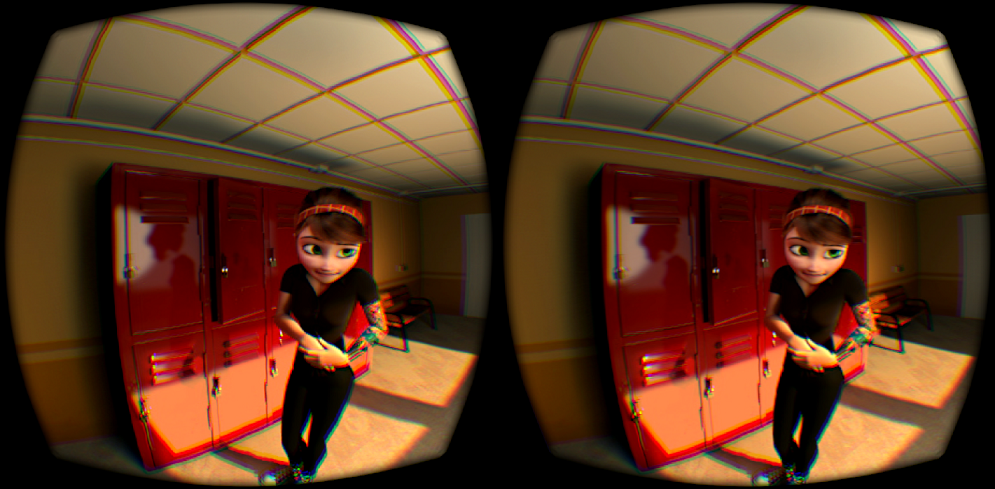

# Mary Gear VR
This is a Gear VR ready version of the [Mary Oculus video](http://pedrofe.com/rendering-for-oculus-rift-with-arnold/) made by [Pedro Fernando Gomez Fernandez](http://pedrofe.com/about-me/). The video is a spherical stereoscopic video rendered with a custom camera for Arnold.

Read the [Instructions](https://github.com/francoislaberge/mary-gearvr#instructions) below for getting it loaded into your GearVR device.

[Preview the video online](http://francoislaberge.com/mary-gearvr/).



All rights for this are reserved by Pedro, [email him](http://pedrofe.com/about-me/) with any questions regarding using his work.

# Instructions 
To get this working on the GearVR. Assumes you already have the Oculus app setup.

  1. Install Milk VR 
    - Best Spherical Sterescopic playback app at the moment
  2. Download ```MaryGearVR.json``` and ```downloads/MaryGearVR.mp4``` to your GearVR device
    - Email the [Downloads](http://francoislaberge.com/mary-gearvr/downloads/) page to yourself for easier downloading
    - ```MaryGearVR.json``` is necessary for Milk VR to recognize and display the video in its UI
  4. When the download is finished, go to ```My files``` app
  5. Tap on ```Storage```
  6. Tap on ```Download```
  7. Tap on the upper right icon (three dots) and tap on ```Select```
  8. Select ```MaryGearVR.mp4``` and ```MaryGearVR.json```
  9. Tap on the upper right icon (three dots) and tap on “Move”
  10. Select ```LocalStorage``` -> ```Android``` -> ```data``` -> ```com.samsung.vrvideo``` -> ```files```
  11. Now, the video is ready for watching with the ```Milk VR``` app, inside the ```Downloaded``` section

See the [References](https://github.com/francoislaberge/mary-gearvr#references) below for more details of how it was made.

# References
  - See Pedro's [blog post](http://pedrofe.com/rendering-for-oculus-rift-with-arnold/) about the video and how it was made using an custom camera for Arnold
  - Here's a [WebVR compatible version](http://threejs.org/examples/#vr_video) for online viewing. It's a three.js VR example
  - I highly recommend you download [Insurgent: Shatter Reality](https://www.youtube.com/watch?v=OMxgo6zoAIM) by [Kite and Lightning](http://kiteandlightning.la/#about) in Milk VR for a much longer example of a spherical stereoscopic video rendered from computer graphics as well
